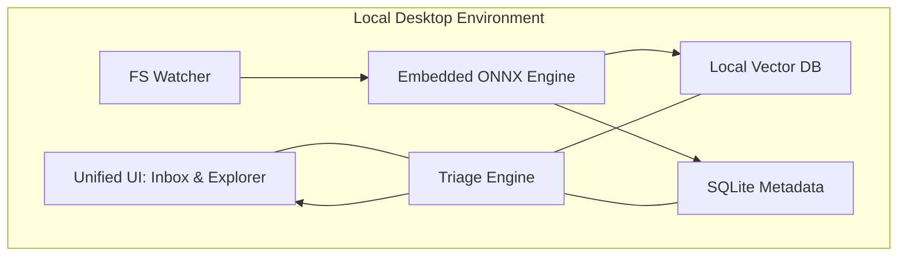
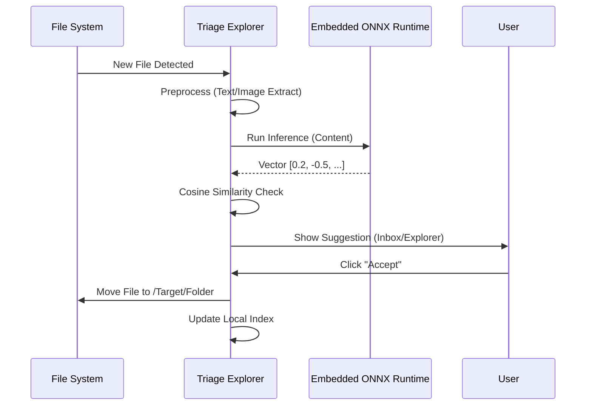

# Spec: AI-Powered Desktop File Manager ("Triage Explorer")

**Date**: 2026-04-07
**Status**: Draft
**Topic**: Desktop application for automated file organization and semantic search using an embedded ONNX model.

---

## 1. Overview
The "Triage Explorer" is a desktop utility designed to solve the problem of cluttered local file systems (Downloads, Desktop, etc.). It uses an embedded ONNX model to understand the semantic content of files (documents, images, archives, media) and suggests optimal organizational structures.

### Key Goals:
- **Auto-Sort**: Detect new files and suggest moves to relevant folders based on content meaning.
- **Triage Workflow**: Provide an "Inbox" where users can quickly accept or reject organizational suggestions.
- **Semantic Search**: Enable natural language and similarity-based search across the local file system.
- **Safe-First**: Ensure no data is moved without user consent (by default) and handle OS permissions robustly.

---

## 2. Architecture & Data Flow

### 2.1 Core Components
1.  **FS Watcher (Background Service)**: Monitors "Monitored Folders" using OS-level events (e.g., `inotify`, `FSEvents`).
2.  **Embedded ONNX Engine**: Loads and runs the exported model locally (e.g., via `onnxruntime`) to generate high-dimensional vectors without external API calls.
3.  **Triage Engine**: Performs vector similarity calculations (Cosine Similarity) between new files and existing folder structures.
4.  **Vector Database (Local)**: Stores embeddings and metadata (e.g., ChromaDB or LanceDB) for sub-second retrieval.
5.  **Unified UI**: A cross-platform desktop interface (e.g., Electron/TypeScript or Python/Qt).

### 2.2 The File Lifecycle
1.  **Detection**: File `budget_v2.xlsx` is saved to `Downloads`.
2.  **Preprocessing**: App extracts text fragments (for docs) or metadata (for binaries).
3.  **Vectorization**: The **Embedded ONNX Engine** processes the content locally; returns a 512/768-dim vector.
4.  **Matching**: Engine compares the vector against the "Target Folders" index.
5.  **Suggestion**:
    *   **Inbox Mode**: Appends item to the "Needs Triage" list.
    *   **Explorer Mode**: Adds a "Suggested Move: /Work/Finance" badge to the file in its current location.
6.  **Resolution**: User clicks "Accept," "Change," or "Ignore."
7.  **Execution**: App performs the physical move and updates the local index.

---

## 3. User Interface (UI) Design

### 3.1 Smart Inbox (Triage View)
- **Proposed Actions**: A list of cards showing `[Preview] | [FileName] -> [Suggested Destination]`.
- **Confidence Indicators**: Visual coding (Green/Yellow) based on similarity scores.
- **Bulk Operations**: "Accept All High Confidence" to clear the inbox instantly.

### 3.2 Semantic Explorer (Standard View)
- **Traditional Navigation**: Standard folder tree sidebar.
- **Ghost Suggestions**: Unsorted files in a folder show a "suggested" path overlay.
- **Smart Categories**: Virtual folders (e.g., "All Invoices," "Nature Photos") that group files semantically regardless of their physical location.

### 3.3 Unified Search Bar
- **Hybrid Input**: Supports filename queries AND natural language ("Show me docs about the project roadmap").
- **Visual Search**: Drag-and-drop a file into the search bar to find semantically similar items.

---

## 4. Technical Integration

### 4.1 Embedding Pipeline
- **Text Extraction**: Uses libraries like `PyPDF2`, `python-docx`, or `Tika`.
- **Image Handling**: Resizing and normalization before sending to the model.
- **Batching**: Files are queued and processed asynchronously to maintain UI responsiveness.

### 4.2 Vector & Metadata Storage
- **Primary Index**: Local Vector DB (ChromaDB/LanceDB).
- **Secondary Metadata**: SQLite database linking Vector IDs to absolute local paths and user-defined tags.

---

## 5. Security, Safety & Testing

### 5.1 Error Handling
- **Service Down**: App queues files for "Delayed Processing" if the embedding service is unreachable.
- **Permission Denied**: "Retry/Skip" dialog for files locked by other processes.
- **Collision Management**: Standard "Keep Both / Overwrite / Skip" logic for naming conflicts during moves.

### 5.2 Testing Strategy
- **Similarity Threshold Tests**: Ensure logic correctly categorizes "High" vs "Medium" confidence.
- **Integrity Tests**: Verify that physical moves are always reflected in the Vector DB.
- **Mock Service**: Use a mock embedding API for CI/CD pipelines to test UI/UX without the heavy model overhead.

---

## 6. Future Scope (Optional)
- **Real-time Monitoring**: Option for fully autonomous sorting for specific high-confidence rules.
- **Custom Model Training**: Allow users to "fine-tune" their categories by providing examples.
- **Cloud Sync**: Optional backup of the vector index (not the files) for cross-device consistency.
